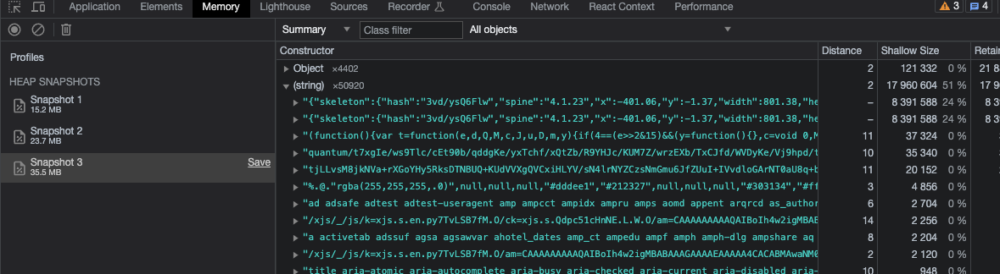
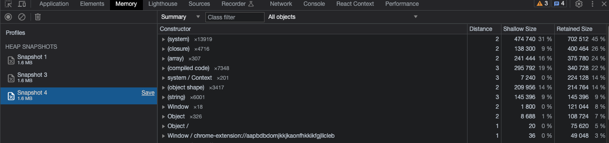

# Chrome Extension Memory Leak Example

Detail of the button code can be seen inside dist folder: 
- content script `popup.js` 
- message responder & sw `background.js`

## Comparison

- Using Button 1 (receive message from runtime sendMessage then console log) 2x click

- Using Button 2 (fetch directly then console log, fetch done) 2x click and fetch done

Environment:
- Manifest MV3
- Chrome Version 115.0.5790.170 (Official Build) (arm64)
- MacOS Ventura 13.2
 